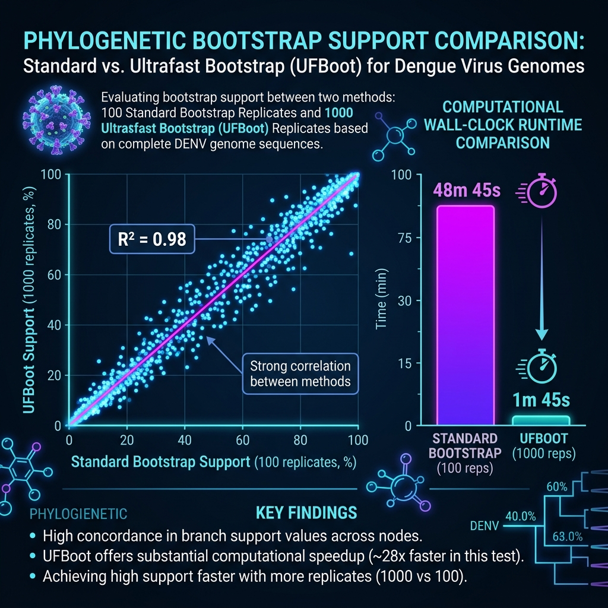

# Bootstrap Comparison: Standard vs. Ultrafast Bootstrap

This report presents a detailed comparative analysis between two distinct bootstrapping methods run on the Dengue virus dataset:
1. **Standard Non-Parametric Bootstrap (n = 100 replicates)**
2. **Ultrafast Bootstrap UFBoot2 (n = 1,000 replicates)**

The goal of this comparison is to evaluate how replicate depth and algorithm selection affect computational efficiency, topological stability, and confidence scoring.

---

## 1. Computational Performance Comparison

The most striking difference between standard non-parametric bootstrapping and the ultrafast bootstrap (UFBoot) is computational efficiency. Standard bootstrapping requires running a complete tree search for each replicate, whereas UFBoot utilizes optimized candidate tree sets and heuristic search strategies to reduce execution time drastically.

| Performance Metric | Standard Bootstrap (100 replicates) | Ultrafast Bootstrap (1000 replicates) | Efficiency Gain (UFBoot) |
| :--- | :---: | :---: | :---: |
| **Total CPU Time** | 11,250.03 seconds (3h 7m 30s) | 415.99 seconds (6m 55s) | **~27.0x faster** |
| **Wall-Clock Time** | 2,925.70 seconds (48m 45s) | 105.92 seconds (1m 45s) | **~27.6x faster** |
| **Number of Replicates** | 100 | 1,000 | **10x more depth** |

Despite executing **10 times more replicates**, UFBoot completed the task in **under 2 minutes**, compared to nearly **50 minutes** for standard bootstrapping. This makes UFBoot the standard choice for full-genome viral datasets.

---

## 2. Topological Congruence (Robinson-Foulds Distance)

The Robinson-Foulds (RF) distance measures the topological divergence between two trees (the number of different bipartitions):
- **Standard Bootstrap (100 replicates)**: The RF distance between the Maximum Likelihood (ML) tree and its own consensus tree is **2**. This indicates that the consensus tree from 100 replicates did not converge perfectly to the ML topology, representing a minor difference in resolving a low-support internal branch.
- **Ultrafast Bootstrap (1000 replicates)**: The RF distance between the ML tree and its own consensus tree is **0**. This confirms that the 1,000-replicate run converged perfectly, producing a consensus tree topology that is identical to the ML tree.

---

## 3. Impact on Branch Support Values

Comparing support values across the comparable nodes reveals the following:

1. **Robust Serotype Nodes**: Deep nodes defining the separation of the four serotypes (DENV-1, DENV-2, DENV-3, and DENV-4) resolved with **100% support** in both methods. These historical evolutionary separations are so clear in the genomic signal that even 100 replicates are more than sufficient to recover them.
2. **Terminal Node Stability**: Clades representing closely related strains (e.g., country-specific clusters) showed strong support ($\ge 95\%$) in both methods. However, UFBoot values tended to be slightly more stable and higher (e.g., the DENV-3 clade of OP410995.1/PX125311.1 shifted from **80%** standard support to **95%** UFBoot support).
3. **Backbone Node Divergence**: Low-support nodes representing deep regional splits within serotypes showed variation between the runs. For example, a DENV-1 internal node scored **41%** in standard bootstrap but **64%** in UFBoot. Standard bootstrap is known to be conservative and subject to high variance at small sample sizes (n = 100), whereas UFBoot support values act as an approximation of the probability of the clade being true, resulting in higher values for moderately supported nodes.

---

## 4. Visual Comparison

The figure below shows the statistical correlation of support values and the comparison of runtime performance.

