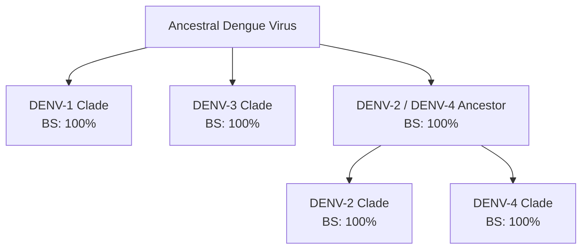

# Phylogenetic Tree Interpretation

This document provides a detailed evolutionary interpretation of the consensus phylogenetic tree constructed using IQ-TREE with 1,000 bootstrap replicates from 28 complete genomes of Dengue virus (DENV).

## 1. Monophyly of Dengue Virus Serotypes

The phylogenetic tree clearly resolves the 28 Dengue virus isolates into **four major, distinct monophyletic clades** representing the four serotypes (DENV-1, DENV-2, DENV-3, and DENV-4). Each serotype clade is supported by a bootstrap value of **100%** at its ancestral node, confirming the evolutionary distinction between the serotypes.

- **Sister Clades**: DENV-2 and DENV-4 share a common ancestral node with **100% bootstrap support**, making them sister serotypes in this reconstruction. DENV-3 forms a sister group to the DENV-2/DENV-4 superclade, while DENV-1 represents the most basal lineage relative to the others.

---

## 2. Serotype-Specific Clade Analysis

### A. Dengue Virus Serotype 1 (DENV-1)
DENV-1 isolates demonstrate sub-clustering that reflects geographic proximity and temporal relationships:
- **KM403622.1 (Singapore, 2013)** and **PV083756.1 (Guangzhou, China, 2014)** cluster together with **100% bootstrap support**, suggesting a direct transmission link or shared origin of the outbreak.
- The remaining DENV-1 sequences, including **JF459993.1 (Myanmar)**, **KJ755855.1 (India)**, and **FJ410280.1 (Vietnam)**, branch out sequentially, showing deeper evolutionary divergence within the serotype.

### B. Dengue Virus Serotype 2 (DENV-2)
The DENV-2 clade consists of 7 sequences, showing highly resolved sub-lineages:
- **PV752120.1 (Sri Lanka, 2017)** and **MH110586.1 (China, 2017)** form a tight cluster with **100% support**.
- **KY427084.1 (India, 2010)** and **KM217156.1 (Pakistan, 2011)** form a sister group with **100% support**, indicating a South Asian sub-lineage.
- These two sub-lineages cluster together with **99% support**, along with **PQ465587.1 (Malaysia, 2015)** and **PQ657766.1 (Bangladesh, 2023)**.
- **EU687250.1 (Vietnam, 2007)** is basal to the rest of the DENV-2 clade (**100% support**).

### C. Dengue Virus Serotype 3 (DENV-3)
DENV-3 sequences partition into two primary groups:
1. **Group I (Southeast & East Asia / South Asia)**:
   - **GU363549.1 (Guangzhou, China)** and **MN253125.1 (India)** cluster together with **100% support**, showing a strong phylogenetic affinity.
   - **ON115814.1** is sister to this group (**96% support**).
   - **OP410995.1 (Singapore, 2014)** and **PX125311.1 (Bali, Indonesia, 2022)** form a separate cluster (**95% support**) within this group.
2. **Group II (Indochina)**:
   - **FJ461326.1 (Vietnam, 2007)** and **KF955461.1 (Cambodia, 1999)** form a sister lineage with **89% support**.

### D. Dengue Virus Serotype 4 (DENV-4)
DENV-4 isolates cluster into two main subgroups with excellent support:
- **Subgroup A**: **KP792537.2 (Singapore, 2011)** and **KY672959.1 (China, 2015)** cluster with **100% support**, sharing a node with **MG272274.1 (India)** (**99% support**).
- **Subgroup B**: **PX368925.1 (Bali, 2019)** and **PV344375.1 (Thailand)** cluster with **100% support**, sister to **PQ555702.1 (Malaysia, 2023)** (**95% support**).
- **KY670635.1 (Philippines)** branches basally to both subgroups with **100% support**.

---

## 3. Support Value Assessment (Reliability)

- **High Confidence ($\ge 95\%$)**: The majority of the internal nodes (18 out of 25) display bootstrap support values $\ge 95\%$. This confirms that the serotype grouping and main regional sub-clusters are highly reliable and topologically robust.
- **Moderate Confidence ($70\% - 95\%$)**: Nodes representing basal splits within serotypes (e.g., DENV-3 Group I vs Group II split at **74%**, DENV-4 Subgroup A vs Subgroup B split at **75%**) show moderate support, reflecting the rapid evolutionary radiation of Dengue lineages.
- **Low Confidence ($< 70\%$)**: Only a few deep internal nodes within the DENV-1 lineage (e.g., **64%** and **74%**) show lower support, which is common when resolving deep ancestral relationships in unrooted trees of rapidly mutating RNA viruses.

---

## 4. Branch Lengths and Evolutionary Rates

- **Long Terminal Branches**: Sequences like **MH110586.1** and **MG272274.1** have relatively long terminal branches. This indicates a higher number of accumulated mutations (substitution events per site) in these specific isolates since their last common ancestor.
- **Short Terminal Branches**: Clusters like **KM403622.1 / PV083756.1** and **KP792537.2 / KY672959.1** have extremely short terminal branch lengths. This signifies high sequence identity and minimal evolutionary divergence, pointing to close epidemiologic relationships (likely active regional transmission networks).
- **Deep Divergence**: The long internal branches separating the four serotype clades ($>0.3$ to $1.0$ substitutions per site) highlight that the serotypes diverged millions of mutational steps ago, reinforcing the structural and immunological differences between them.
